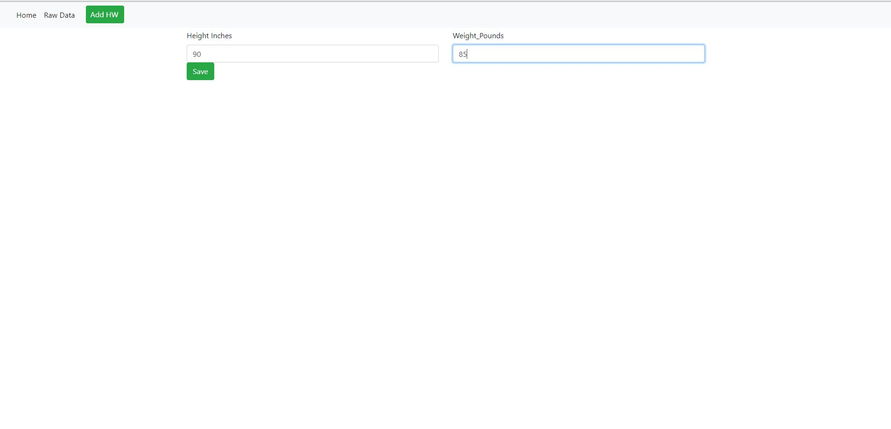
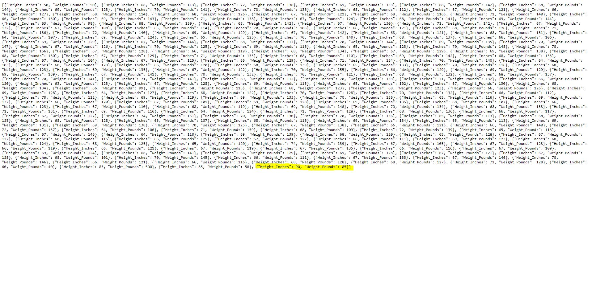
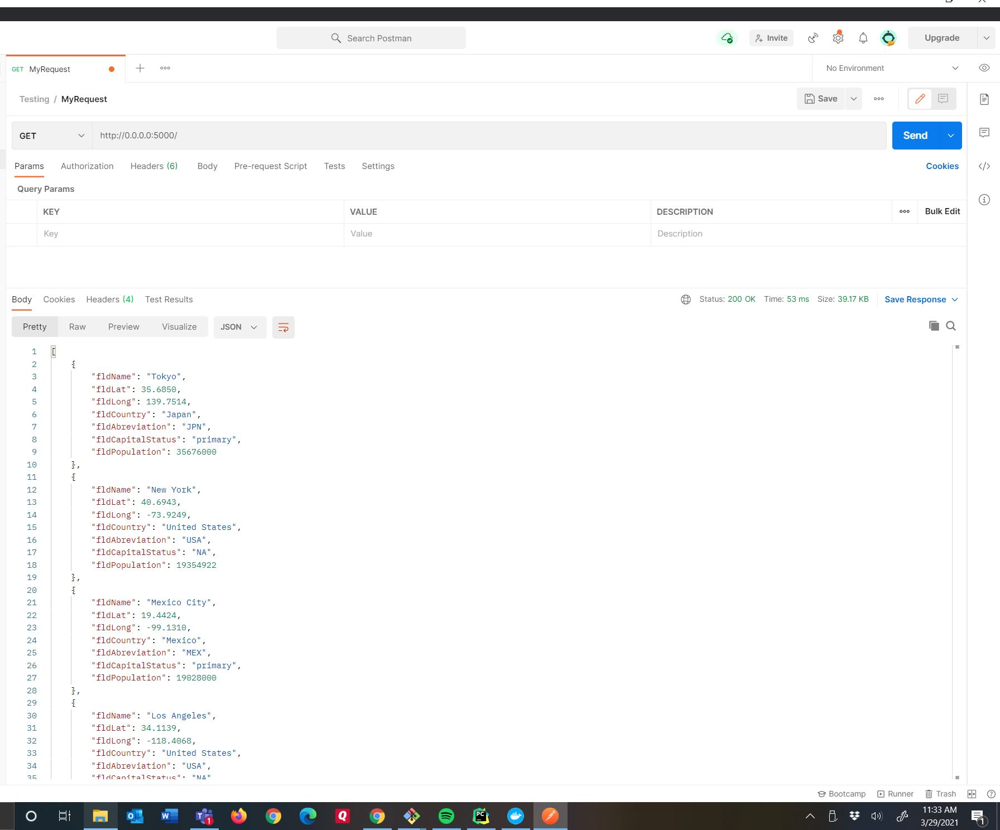

## Web Application - IS 218 - Franklin Tan
## Parts 3 & 4 & Adding Authentication
## Concepts Used
* Using Flask Framework
* Jinja for Rendering
* Docker
* Postman

# Database

# Homepage

# Homepage Data

# Adding Record

# New Record Added

# Postman

# Sources
1. [Creating Your First Flask Application](https://hackersandslackers.com/your-first-flask-application/)
1. [Flask Web Development](https://flask.palletsprojects.com/en/1.1.x/)
1. [Flask Homepage and Documentation](https://flask.palletsprojects.com/en/1.1.x/)
1. [JSON Spec Reference](https://www.json.org/json-en.html)

# Last Update - April 2021
